# Resultats
Aquest document presenta els resultats obtinguts d'avaluar els diferents models implementats, explicats a `arquitectures.md`, en aquest projecte. A continuació, s'analitza el seu rendiment fent servint diferents mètriques.

## Mètriques utilitzades

### WER (Word Error Rate)
Aquesta mètrica és a nivell de paraules, calcula el nombre mínim d'insercions, esborraments i substitucions d'una paraula per una altra, necessaris per a transformar una frase en una altra. 

### CER (Character Error Rate)
Aquesta mètrica és a nivell de caràcters, calcula el nombre mínim d'insercions, esborraments i substitucions de caràcters necessaris per transformar una paraula en una altra. 
Aquesta mètrica és utilitzada perquè, sobretot els models CTC, no són capaços de prediure correctament paraules senceres, però si textos semblants.

## Resultats

### Model Baseline
- **WER:** 0.7925
- **CER:** 0.5885
- **Gràfiques:**

  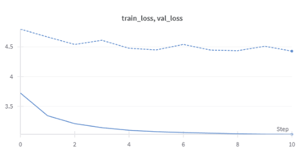
  
<em>Baseline Loss</em>

  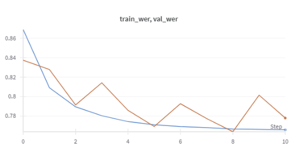
  
<em>Baseline WER</em>

- **Observacions:** Primer de tot vam fer una cerca de paràmetres per a veure quina combinació era la millor. Totes les provades donaven resultats similars. El punt de partida és molt pobre, amb un error de paraules proper al 0.79, i un error de caràcters també elevat, al voltant de 0.59. Això indica que el model base no està capturant bé les característiques de l'entrada i no reconeix correctament el parlar. 

### Model AttentionModel

Aquest model té un paràmetre anomenat *teacher forcing*. Vam fer diferents proves ajustant aquest paràmetre:

#### 1. `teacher forcing = 1 - 0.1 * num_epoch`

  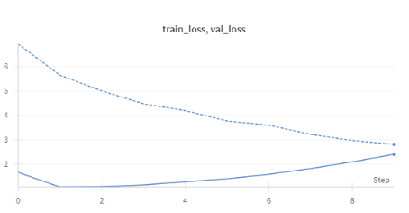
  
<em>Loss tf 1 - 0.1 * num_epoch</em>

  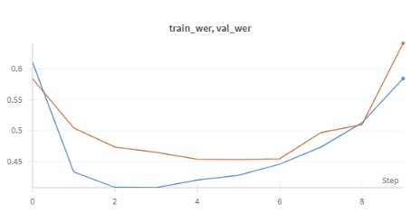
  
<em>WER tf 1 - 0.1 * num_epoch</em>

La loss empitjora a mesura que passen les èpoques. El model no ha arribat a aprendre abans de treure-li el reforç.

#### 2. `teacher forcing = 0.5 - num_epoch // 2 / 10`

  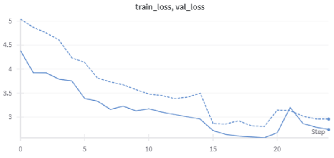
  
<em>Loss tf 0.5 - num_epoch // 2 / 10</em>

  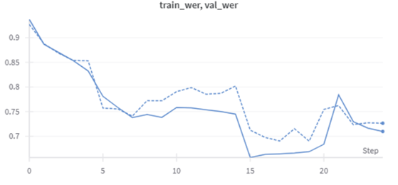
  
<em>WER tf 0.5 - num_epoch // 2 / 10</em>

El model ha après una mica. Tot i així, els resultats podrien ser més satisfactoris.

#### 3. `teacher forcing = 0.5` (constant)

  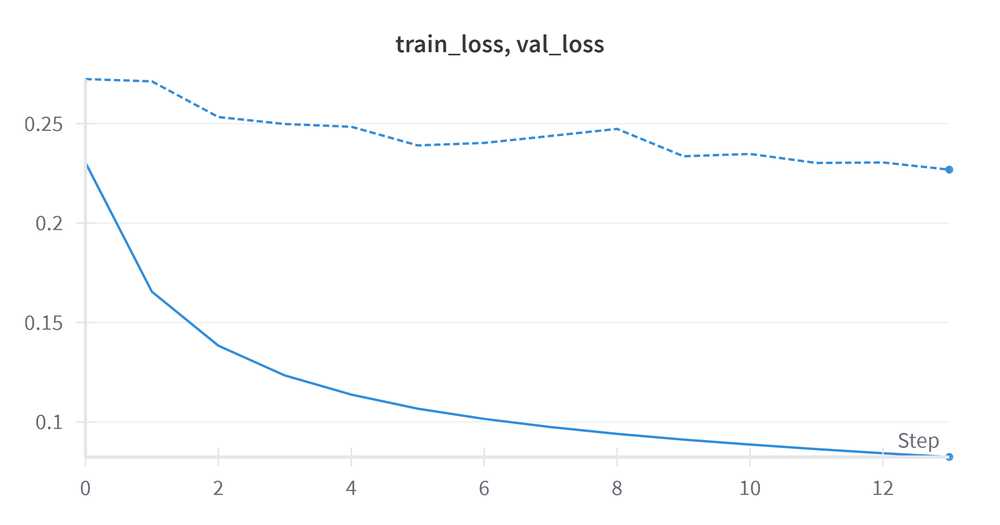
  
<em>Loss tf 0.5</em>

  
  
<em>WER tf 0.5</em>

Aquesta ha estat la millor configuració i és la que hem adoptat. Resultats:

- **WER:** 0.5015
- **CER:** 0.2675
- **Observacions:** El model baseline afegint attention, millora significativament respecte el baseline, amb una WER al voltant de 0.50 i una CER aproximadament de 0.27. Tot i així, encara es detecta un marge important de millora, ja que gairebé la meitat de les paraules són incorrectes. El model encara pot beneficiar-se de més dades i arquitectures més complexes per reduir encara més els valors d'aquestes mètriques.

### Model DeepCTCModel
- **WER:** 0.8407
- **CER:** 0.3543
- **Gràfiques:**

  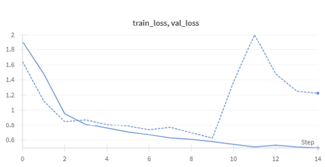
  
<em>CTC Loss</em>

  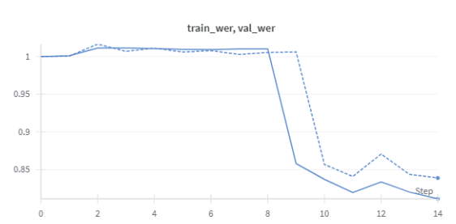
  
<em>CTC WER</em>

- **Observacions:** Aquest model, com que és model que copia l'estructura anterior (sense l'atenició), però passat a CTC, fa que aquest no mostri una millora respecte al model anterior. Tot i això, la CER de 0.35 indica que el model transcriu fora millor a nivell de caràcters que el model baseline, però continua cometent molts errors a l'hora de formar paraules completes, com reflecteix una WER del 0.84. Aquesta situació suggereix que el model és capaç de captar part de la fonètica o ortografia, per això tenim la mètrica CER també, però li manca capacitat per entendre estructures més complexes del llenguatge o per captar la dependència entre caràcters i paraules. També observem de les gràfiques que a partir de l'època 9, el model ens ha començat a fer overfitting. A l'època 12 vam provar de tornar a començar des de l'època 9, però el resultat va ser novament overfitting. Per tal de millorar aquests resultats, es planteja afegir més capes al model i augmentar-ne la complexitat.

### Model DeepCTCModelV2
- **WER:** 0.9236
- **CER:** 0.4317
- **Gràfiques:**

  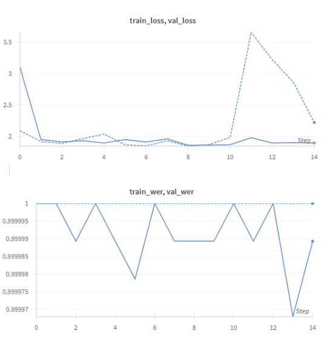
  
<em>CTC Complex execució 1</em>

  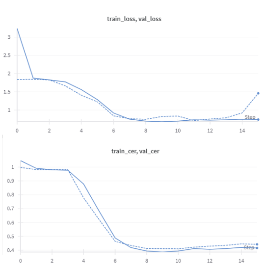
  
<em>CTC Complex execució 2</em>

- **Observacions:** Tot i ser un model més profund que l'anterior, no hem aconseguit que ens doni millors resultats. Hem provat diferents combinacions de paràmetres i aquests són els millors resultats. Hi ha hagut combinacions on el model no ha arribat a aprendre.

### Model basat en el DeepSpech2
- **WER:** 0.3402
- **CER:** 0.1071
- **Gràfiques:**

  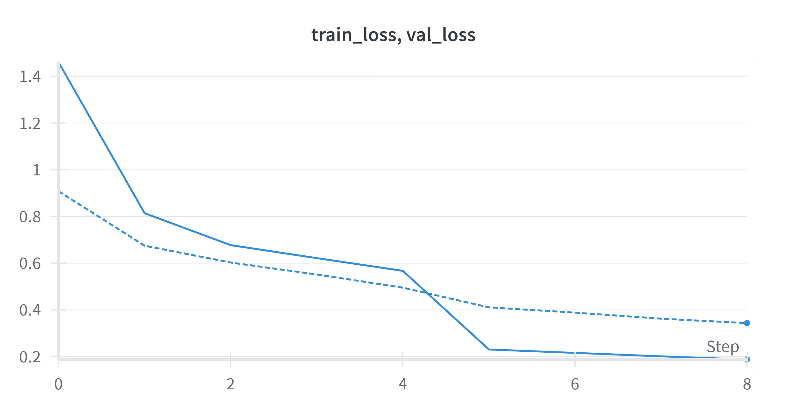
  
<em>Model basat en el DeepSpeec2 Loss</em>

  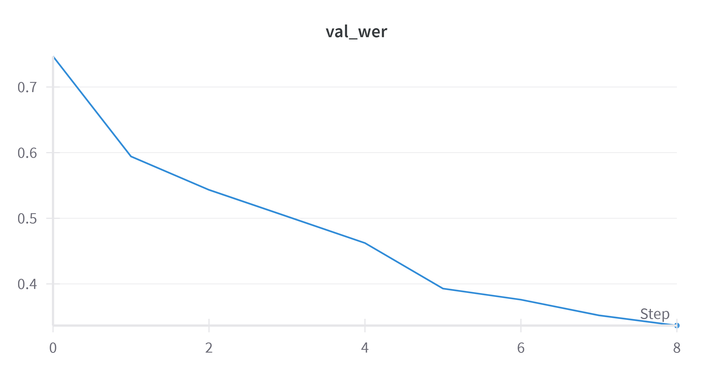
  
<em>Model basat en el DeepSpeec2 WER</em>

  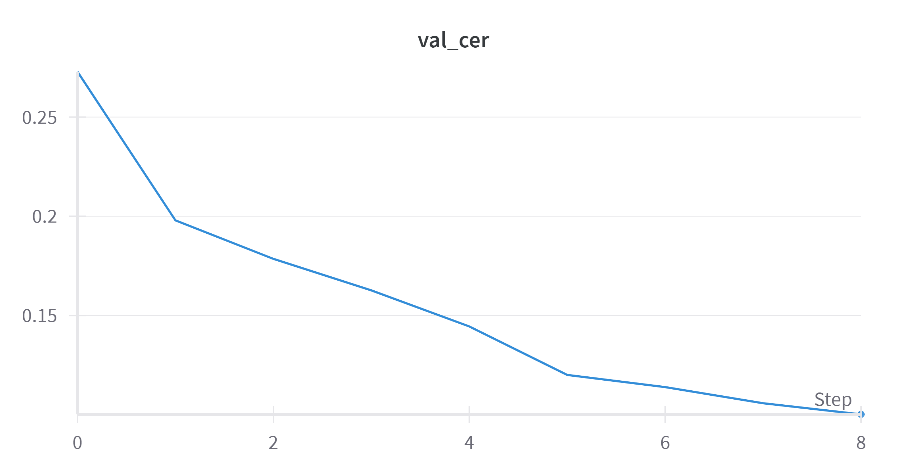
  
<em>Model basat en el DeepSpeec2 CER</em>

- **Observacions:** El model basat en DeepSpeech2 mostra una millora significativa respecte als models anteriors, tot i ser bastant similar a l'anterior. Suposem que aquesta diferència en els resultats ve donada perquè aquest model rep un spectograma com a input, no un tensor unidimensional. Obté les millors CER i WER dels models implementats. Això suggereix que l’arquitectura i els mecanismes implementats en DeepSpeech2 són més adequats per aquesta tasca, tot i que encara queda marge de millora per perfeccionar aquest Speech to Text.

## Comparació 

| Model                |  WER  |  CER  |
|----------------------|-------|-------|
| Baseline             |  0.79 |  0.58 |
| Attention            |  0.50 |  0.26 |
| DeepCTC              |  0.84 |  0.35 |
| DeepCTCV2            |  0.92 |  0.43 |
| DeepSpech2 (basat)   |  0.34 |  0.10 |

## Resultats qualitatiu del model basat en DeepSpeech2

Seguidament, en aquest apartat es mostraran resultats qualitatius obtinguts del millor model, model basat en DeepSpeech2. Es podràn observar 10 exemples de la referència de l'àudio i la transcripció generada pel model. D'aquesta manera es podrà avaluar el model de manera qualitativa:

- Referència 1: Per a la resta de lleis, es requereix la majoria simple de cada cambra.
- Model: Però la resta de lleis es requereix la majoria simple de cada cambra.

- Referència 2: Fins a quin punt és decisiu?
- Model: Fins a quin pont es dàcisiu?

- Referència 3: Més endavant, Parr va ser l'editor de la revista "Glasnost", una publicació antisoviètica.
- Model: Més endavant, par va ser l'editor de la revista Glans Nosts, una publicació antisoviètica.

- Referència 4: El nou d'octubre na Sibil·la i en Ton iran a la Fuliola.
- Model: El nou  d'octebrem esiera i en Con iran a Ruidola.

- Referència 5: Diu que no hi ha cap secret màgic, només l'entrenament dur i l'acompanyament.
- Model: Diu que o i ha cap secretc màgic, només l'entrenemindú i l'acompanyament.

- Referència 6: Les locomotores van ser construïdes per Kerr, Stuart i companyia.
- Model: Les nocumotores van ser construïdes perKe Stuat i Companyi.

- Referència 7: L'ús d'algoritmes al sector públic.
- Model: L'ús delgrigmes al sector públic.

- Referència 8: Doncs ens has de donar una altra targeta per garantir la reserva.
- Model: Doncs en s'has a donar una altra targata per rcarantir la reserva.

- Referència 9: Per tot arreu es veien botigues
- Model: Per tot arreu es veien botigues.

A partir d'aquests exemples, es pot observar on el model comet errors, si desglossem aquest:
- Estudiant el segon exemple, es diagnostica com el model té dificultats per distingir sons similars, la qual cosa implica errors a l'hora de predir paraules, però, predient paraules fonèticament properes. Això es veu reflectit amb la paraula "punt" predita pel model com "pont" o "decisiu" com "dàcisiu".
- Com era d'esperar, per la poca representació de certes paraules al conjunt d'entrenament, el model falla a l'hora de transcriure noms propis, de persona, llocs... Aquest problema s'observa en els exemples 3 i 6 on noms com "Parr", "Glasnost", "Kerr" i "Stuart" són predits com "par", "Glans Nosts", "perKe" i "Stuat" respectivament.
- Continuant observant l'exemple 6, i estudiant el 4, es pot considerar que també es produeixen errors en segmentar les paraules o ometent espais, per exemple, "per Kerr" es transcriu com "perKe" i "na Sibil·la" com "esiera". Però, això també es detecta quan paraules amb un ús normal tenen terminacions poc habituals, com a l'exemple 5, "entrenament dur" es prediu com "entrenemindú".
- Fins al que s'ha analitzat fins al moment, es pot concloure que les prediccions del model contenen el significat de la referència, però, considerant l'exemple 1, es pot observar com un únic error canvia tot el significat de la frase, ja que, originalment la referència diu "Per a la resta de lleis..." i es prediu com "Però la resta de lleis...".
- En algun cas també es pot veure que el model té dificultat per a saber quan posar lletres no sonores. Per exemple, en l'exemple 5 ha escrit "hi ha" com "i ha". Tot i que no sempre s'equivoca, aquesta és una altra font d'errors.
- Malgrat tots aquests errors que comet el model en predir, cal destacar la precisió de transcriure frases amb un vocabulari habitual, per exemple, la referència 9, "Per tot arreu es veien botigues" es prediu a la perfecció.

Sintetitzant, el model basat en DeepSpeech2 mostra un bon comportament general en farses comunes i amb vocabulari freqüent, tot i això, es detecten alguns problemes:
- Reconeixement de noms propis i paraules poc freqüents.
- Confusions fonètiques.
- Segmentació incorrecta.

## Resultats per dialecte

A continuació, es mostrarà els resultats del millor model, model basat en el DeepSpech2, desglossats per dialecte. Aquesta anàlisi permet observar com el model es comporta en diferents variants del català, mostrant la WER i CER específiques per a cada dialecte.

| Dialecte                |  WER  |  CER  | %Dades train |
|-------------------------|-------|-------|--------------|
| Central                 |  0.33 |  0.10 |     22.4     |
| Nord-occidental         |  0.32 |  0.11 |      2.5     |
| Valencià                |  0.40 |  0.13 |      2.1     |
| Balear                  |  0.43 |  0.13 |      1.3     |
| Septentrional           |  0.23 |  0.13 |      0.9     |

D'aquests resultats filtrats pel dialecte podem extreure:
- El nostre model obté un rendiment consistent amb WERs entre 0.23 i 0.43 i CERs al voltant de 0.10-0.13 en tots els dialectes analitzats.
- El dialecte central és el que presenta millors resultats en termes de CER, ja que és el dialecte que s'han utilitzat més dades per entrenar.
- El dialecte septentrional, tot i tenir només un 0.9% de dades d’entrenament, presenta la millor WER, 0.23, probablement per la seva semblança amb el català central
- Els dialectes amb menys dades d’entrenament, com el valencià i el balear, mostren els valors més alts de WER, 0.40 i 0.43 respectivament. Aquests dialectes són més diferents que el septentional respecte al central, de manera que afecta negativament.
- Finalment, és recomanable augmentar la diversitat i la quantitat de dades específiques per dialectes menys representats per millorar el rendiment global i equilibrar la precisió entre variants dialectals.

